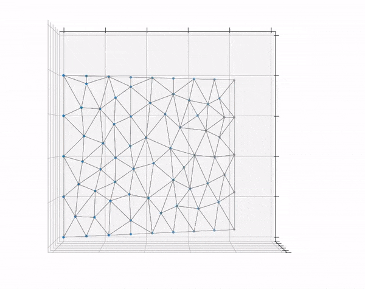
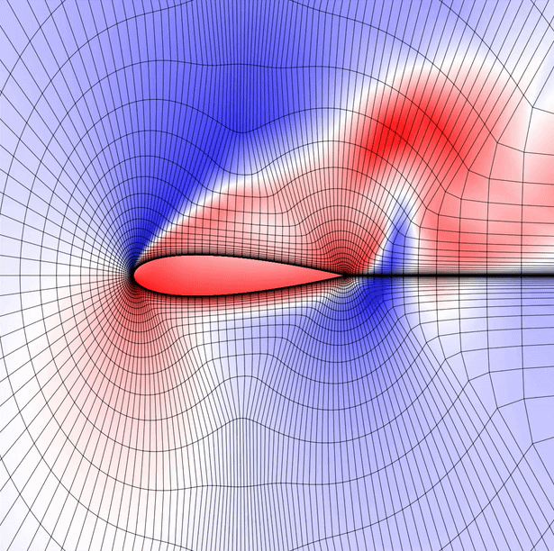
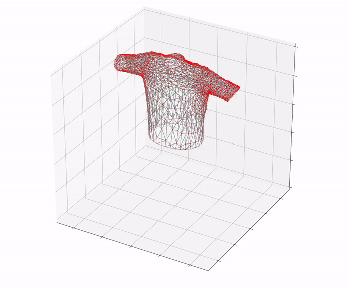
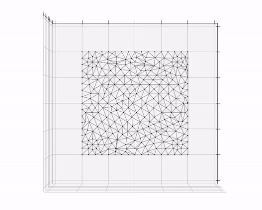

# 📦 PDEs Dataset Generator

A tool for generating datasets for Partial Differential Equations (PDEs) from ARCSim, FEniCS and SU2.

## 💡 Introduction

Research on PDEs needs ground truth datasets. Several tools have been developed and among all, the open-source FEniCS is one of the most famous ones. Our goal is to provide tools for more easily creating such datasets and save them in the DGL graph format. 

Features:

- Compressed scripts containing full generating process, including creating domain, generating mesh, creating boundary constrains, solve function, transfer mesh and result to dgl graph and saving 
- Results are transferred to DGL graph, which is convenient to use in graph models; we also provide numpy tools
- Detailed tutorials with notebooks to show how our scripts work and knowledge about using ARCSim, FEniCS and SU2
- Useful mini tools, including mesh to DGL transferring and modified dgl graph plotting

## 🔧 Environment 

```Python
Python Version: 3.6 or later
Python Packages: jupyterlab, fenics, dgl, numpy, torch, matplotlib
```

## 📁 Structure

```
.
├── fig/
├── notebook/
│   └── *
├── src/
│   ├── utils/
│   └── *
└── README.md
```

- `fig`: example figures
- `notebook`: tutorials in jupyter notebook format
- `src`: all source code will be here, including scripts, tools
  - `utils`: mini tools will be here, including dgl transferring, graph plot

Here are brief guides for the supported PDE simulators:
- [Guide with ARCSim](#📖-guide-with-arcsim):
- [Guide with Fenics](#📖-guide-with-fenics):
- [Guide with SU2](#📖-guide-with-su2):

---

## 📖 Guide with ARCSim
**Step 1**. [Download](https://github.com/cbhua/tool-pdeset-generator/archive/refs/heads/main.zip) or [Clone](https://github.com/cbhua/tool-pdeset-generator.git) this repository

**Step 2**. ArcSim installation

You may find the repository with fixes [here](https://github.com/kaist-silab/arcsim) with further instructions.
To install it, run the following:

`git clone https://github.com/kaist-silab/arcsim.git && cd arcsim/`

`sudo chmod +x install.sh && sudo ./install.sh`

At this point, you should be ready to go.

**Step 3**. ArcSim simulation and `.obj` file saving
Let's consider the flag example. In the ArcSim folder, make a new directory called data. Then run:

`bin/arcsim simulate conf/flag.json data/`

(you may also run `simulateoffline` if you cannot visualize on your computer

When the simulation ends (we may do that with `Esc` as well) copy the `conf/flag.json` into the folder where we saved the simulation, in our case`data/` and run:

`bin/arcsim generate data/`

This will generate `.obj` files that we can load into Python with `pywavefront` and the `obj_to_dgl` method we provide.



*Flag simulation with adaptive remeshing*

---

## 📖 Guide with FEniCS

**Step 1**. [Download](https://github.com/cbhua/tool-pdeset-generator/archive/refs/heads/main.zip) or [Clone](https://github.com/cbhua/tool-pdeset-generator.git) this repository.  

**Step 2**. Based on your requirement refer to the notebooks, where there are tutorials and examples. You can find all methods provided in the below list. 

**Step 3**. Modify the parameters to generate your own datasets. 

Provided methods:

- Poisson process
  - Customize domain & Single boundary control
  - Square domain & Separate boundary control
- Gaussian process
  - Customize domain & Single boundary control (support time dynamic control)
  - Square domain & Separate boundary control (support time dynamic control)
  - Squares in square domain & Separate boundary control (support time dynamic control)
  - Circles in circle domain & Single boundary control (support time dynamic control)

Support methods will keep updating. For more detail, you can refer to the [project manager](https://github.com/cbhua/tool-pdeset-generator/projects/1). 


*Gaussian process on rectangular domain*

---

## 📖 Guide with SU2

**Step 1**. [Download](https://github.com/cbhua/tool-pdeset-generator/archive/refs/heads/main.zip) or [Clone](https://github.com/cbhua/tool-pdeset-generator.git) this repository

**Step 2**. Install [SU2](https://su2code.github.io/download.html)

**Step 3**. Modify the parameters to generate your own datasets


*Laminar viscosity of an airfoil*

---

## 📊 Examples Gallery

### T-shirt and interactions with hard bodies


### Paper tearing


### Possion process, square domain, single boundary control


### Possion process, L shape domain, single boundary control


### Possion process, circle shape domain, single boundary control


### Gaussian process, rectangle shape domain, multi & dynamic boundary control


## 📜 References

1. FEniCS project: https://fenicsproject.org/
2. ARCSim project: http://graphics.berkeley.edu/resources/ARCSim/
3. DGL project: https://www.dgl.ai/
4. SU2 project: https://su2code.github.io/
