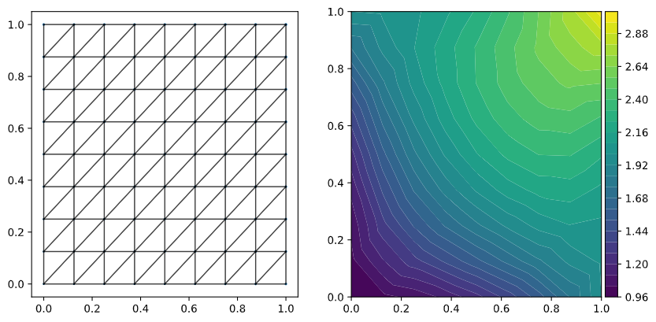
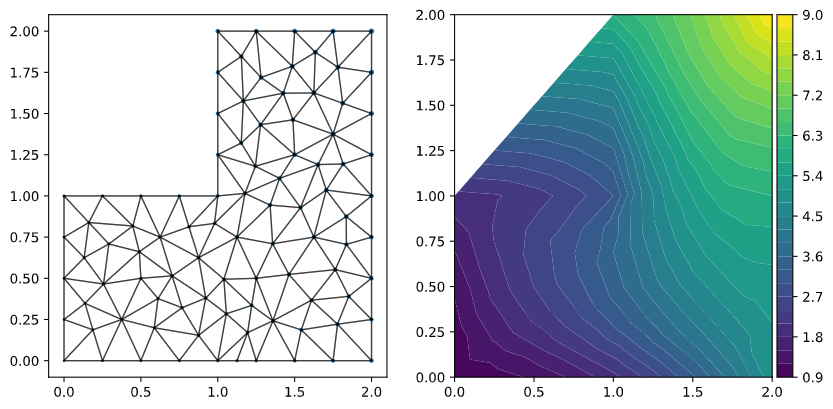
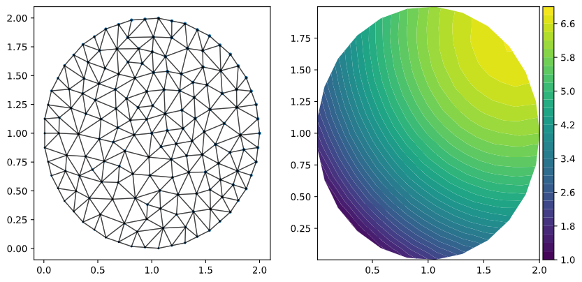
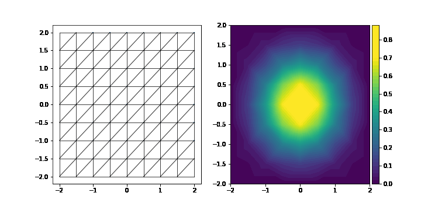
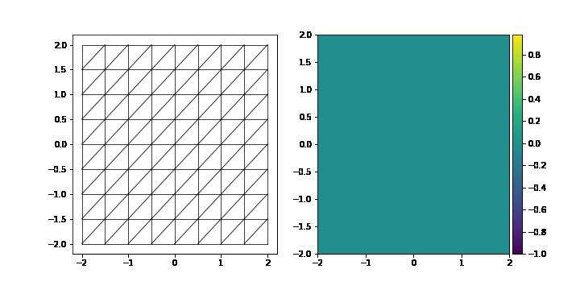

# 📦 PDEs Dataset Generator

A tool for generating dataset about several PDE process based on FEniCS. 

## 💡 Introduction

Researches on PDEs may need ground truth datasets. Several tools can meet this requirement, FEniCS is one of the most famous tools. We here are going to provide some scripts to help us to more easily create such datasets and save them in DGL graph format. 

Features:

- Compressed scripts, contain full generating process, including create domain, generate mesh, create boundary constrains, solve function, transfer mesh and result to dgl graph, and then save them. 
- Results will be trainsferred to dgl graph, which is more convenient to use in graph model. We also going to provide numpy tools. 
- In detail tutorial. We provide notebooks to show how our scripts work and knowledge about using FEniCS. 
- Provide useful mini tools, including mesh to dgl transferring, dgl grpah plotting, etc. 

## 🔧 Environment 

```Python
Python Version: 3.6 or later
Python Packages: jupyterlab, fenics, dgl, numpy, torch, matplotlib
```

## 📁 Structure

```
.
├── fig/
├── notebook/
│   └── *
├── src/
│   ├── utils/
│   └── *
└── README.md
```

- `fig`: example figures
- `notebook`: tutorials in jupyter notebook format
- `src`: all source code will be here, including scripts, tools
  - `utils`: mini tools will be here, including dgl transferring, graph plot

## 💾 How to use

**Step 1**. [Download](https://github.com/cbhua/tool-pdeset-generator/archive/refs/heads/main.zip) or [Clone](https://github.com/cbhua/tool-pdeset-generator.git) this repository.  

**Step 2**. Based on your requirement refer to notebooks, there would be tutorials and examples. You can find all methods provided in below list. 

**Step 3**. Modify parameters to generate your datasets. 

Provided methods:

- Possion process
  - Customize domain & Single boundary control
  - Square domain & Separate boundary control
- Gaussian process
  - Customize domain & Single boundary control (support time dynamic control)
  - Square domain & Separate boundary control (support time dynamic control)
  - Squares in square domain & Separate boundary control (support time dynamic control)
  - Circles in circle domain & Single boundary control (support time dynamic control)

Support methods will keep updating. For more detail, you can refer to the [project manager](https://github.com/cbhua/tool-pdeset-generator/projects/1). 

## 📊 Examples

### Possion process, square domain, single boundary control



### Possion process, L shape domain, single boundary control



### Possion process, circle shape domain, single boundary control



### Gaussian process, rectangle shape domain, single boundary control



### Gaussian process, rectangle shape domain, multi & dynamic boundary control



## 📜 Reference

1. FEniCS project: https://fenicsproject.org/
2. DGL project: https://www.dgl.ai/